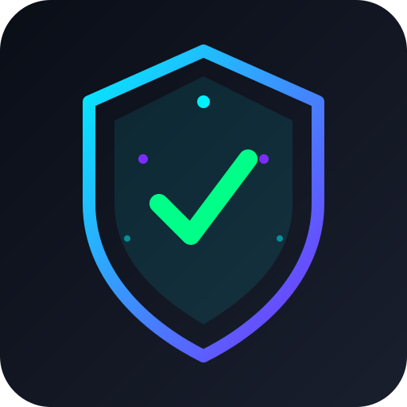

# VP-Shield Frontend

<p align="center">
  
</p>

<p align="center">
  <strong>网络安全监控与防御系统 - 前端</strong>
</p>

<p align="center">
  <a href="#功能特性">功能特性</a> •
  <a href="#技术栈">技术栈</a> •
  <a href="#快速开始">快速开始</a> •
  <a href="#项目结构">项目结构</a> •
  <a href="#开发指南">开发指南</a>
</p>

<p align="center">
  
  
  
  
</p>

---

## 功能特性

### 📊 实时流量监控
- 基于 ECharts 的实时流量图表
- 正常/异常流量双线对比展示
- PPS（每秒包数）统计：当前、平均、峰值
- 支持明暗主题切换

### 🛡️ 攻击模拟与防护控制
- 网络接口选择与刷新
- 抓包监控启停控制
- 回环测试配置（包数量、攻击源数量）
- 封禁 IP 列表管理
- 流量限速状态显示

### 📝 安全审计日志
- 终端风格日志展示
- 多级别日志过滤（info/success/warning/danger）
- 实时滚动与自动更新
- 日志导出功能

### 🚨 实时告警系统
- 攻击检测告警弹窗
- 威胁详情展示（类型、来源IP、严重程度）
- 一键处理功能

### 🎨 现代化界面
- 毛玻璃效果与渐变背景
- 明暗主题完美适配
- 响应式布局设计
- 流畅的过渡动画

## 技术栈

| 技术 | 版本 | 用途 |
|------|------|------|
| Vue 3 | 3.5 | 前端框架 (Composition API) |
| Electron | 33 | 桌面应用框架 |
| Vite | 8 | 构建工具 |
| Pinia | 2.2 | 状态管理 |
| ECharts | 5.5 | 图表可视化 |
| Tailwind CSS | 3.4 | 样式框架 |

## 快速开始

### 环境要求

- Node.js `>= 20.19.0` 或 `>= 22.12.0`
- npm `>= 9.0.0`
- Java 17（JRE）- Electron 打包模式需要

### 安装依赖

```bash
npm install
```

### 下载 JRE（Electron 打包模式）

Electron 打包模式需要内置 JRE 17 运行后端服务。运行以下命令自动下载：

```bash
npm run download-jre
```

> 下载源为清华大学镜像，国内速度较快。JRE 约 126MB。

**手动下载**（如果自动下载失败）：
1. 从 [清华镜像](https://mirrors.tuna.tsinghua.edu.cn/Adoptium/17/jre/x64/windows/) 下载 JRE 17
2. 解压后将文件夹重命名为 `jre`
3. 放到 `electron/resources/jre/` 目录

### 开发模式

```bash
# 仅前端开发（连接独立运行的后端）
npm run dev

# Electron 开发模式
npm run electron:dev
```

### 构建生产版本

```bash
# 构建前端
npm run build

# 构建 Electron 安装包
npm run electron:build
```

## 项目结构

```
vp-shield-frontend/
├── electron/
│   ├── main.cjs          # Electron 主进程
│   └── preload.cjs       # 预加载脚本
├── src/
│   ├── assets/
│   │   ├── main.css      # 全局样式与主题变量
│   │   └── base.css      # 基础样式
│   ├── components/
│   │   ├── Dashboard.vue       # 实时流量监控
│   │   ├── AttackControl.vue   # 攻击控制面板
│   │   ├── SecurityLogs.vue    # 安全日志
│   │   ├── AlertModal.vue      # 告警弹窗
│   │   ├── Sidebar.vue         # 侧边栏
│   │   └── TitleBar.vue        # 标题栏
│   ├── stores/
│   │   └── shield.js     # Pinia 状态管理
│   ├── App.vue           # 根组件
│   └── main.js           # 入口文件
├── public/
│   └── favicon.ico       # 应用图标
├── package.json
├── vite.config.js
├── tailwind.config.js
└── electron-builder.json
```

## 开发指南

### 与后端配合

本项目需要配合 [VP-Shield 后端](https://github.com/fkwhao/vp-shield) 使用。

**独立开发模式：**
1. 在 IDEA 中启动后端服务（端口 8080）
2. 运行 `npm run dev` 启动前端
3. 前端会自动检测并连接后端

**Electron 打包模式：**
1. 构建后端 JAR 包
2. 修改 `electron/main.cjs` 中的 JAR 路径
3. 运行 `npm run electron:build`

### API 通信

#### WebSocket 端点

```
ws://localhost:8080/ws/traffic
```

#### REST API

| 端点 | 方法 | 描述 |
|------|------|------|
| `/api/v1/status` | GET | 系统状态 |
| `/api/v1/interfaces` | GET | 网络接口列表 |
| `/api/v1/capture/start` | POST | 启动抓包 |
| `/api/v1/capture/stop` | POST | 停止抓包 |
| `/api/v1/test/start` | POST | 启动回环测试 |
| `/api/v1/test/stop` | POST | 停止测试 |
| `/api/v1/block/list` | GET | 封禁 IP 列表 |
| `/api/v1/block/{ip}` | DELETE | 解封 IP |

#### Electron IPC

```javascript
// 后端控制
await window.electronAPI.startBackend()
await window.electronAPI.stopBackend()
await window.electronAPI.getBackendStatus()

// 窗口控制
window.electronAPI.minimizeWindow()
window.electronAPI.maximizeWindow()
window.electronAPI.closeWindow()

// 事件监听
window.electronAPI.onBackendLog(callback)
window.electronAPI.onBackendStatus(callback)
```

### 主题定制

在 `src/assets/main.css` 中修改 CSS 变量：

```css
:root {
  --brand: #0071e3;
  --success: #16a34a;
  --warning: #d97706;
  --danger: #dc2626;
  /* ... */
}

:root[data-theme='dark'] {
  --brand: #60a5fa;
  --success: #22c55e;
  --warning: #f59e0b;
  --danger: #f87171;
  /* ... */
}
```

## 界面预览

### 明亮主题
- 清爽的白色背景
- 蓝色主色调
- 适合日间使用

### 暗黑主题
- 深色背景减少眼睛疲劳
- 高对比度配色
- 适合夜间监控

## 相关项目

- [VP-Shield Backend](https://github.com/fkwhao/vp-shield) - Java 后端服务

## 许可证

[MIT License](LICENSE)

---

<p align="center">
  Made with ❤️ by VP-Shield Team
</p>
